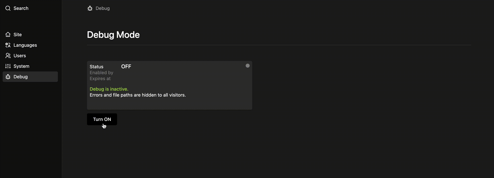

# Debug Toggle for Kirby 5

A Kirby 5 CMS panel plugin that provides a safe, time-limited debug mode toggle with automatic expiry and git-safe flag file management.


## Features

- **Flag-based debug control** - Uses a `.debug_enabled` flag file instead of modifying `config.php`
- **Auto-expiry** - Debug mode automatically disables after configured hours
- **Permission system** - Restrict access by admin status, role name, or custom callback
- **Git-safe** - Automatically adds flag file to `.gitignore`
- **Panel UI** - Clean card-based interface with status indicator
- **Dark/Light mode** - Fully responsive to Kirby panel theme
- **Real-time status** - Shows who enabled debug and when it expires

## Demo
 


## Why this exists

The built-in Kirby workarounds for toggling debug mode didn't fully fit my needs. So I built this for myself. It does exactly what I need and nothing more. If it fits yours too, feel free to use it.

## Installation

### Manual Installation

1. Download and extract the plugin to `site/plugins/debug-toggle/`
2. The plugin structure should be:
   ```
   site/plugins/debug-toggle/
   ├── index.php
   ├── index.js
   ├── index.css
   ├── README.md
   └── LICENSE
   ```

### Composer Installation

```bash
composer require martino/kirby-debug-toggle
```

## Configuration

**⚠️ Required:** Add the following to your `site/config/config.php`:

```php
return [
    // REQUIRED: Debug mode controlled by flag file
    // Replace any existing 'debug' => true with this closure
    'debug' => (function() {
        $flag = __DIR__ . '/.debug_enabled';
        if (!file_exists($flag)) return false;
        $data = json_decode(file_get_contents($flag), true);
        if (!$data || empty($data['expires_at'])) return false;
        return time() < $data['expires_at'];
    })(),
    
    // OPTIONAL: Plugin configuration (uses defaults if omitted)
    'Martino.debug-toggle.expiry-hours' => 4,  // Hours until auto-disable (default: 4)
    'Martino.debug-toggle.permission' => 'admin',  // Who can toggle (default: 'admin')
];
```

**Important:** The `debug` closure is required for the plugin to work. Without it, the panel UI will appear but debug mode won't actually activate when toggled.

## Configuration Options

### `Martino.debug-toggle.expiry-hours`

**Type:** `int`  
**Default:** `4`

Number of hours until debug mode automatically disables.

```php
'Martino.debug-toggle.expiry-hours' => 8,  // 8 hours
```

### `Martino.debug-toggle.permission`

**Type:** `string|callable`  
**Default:** `'admin'`

Controls who can access and toggle debug mode.

**Options:**

1. **`'admin'`** - Only users with admin status (uses `isAdmin()`)
   ```php
   'Martino.debug-toggle.permission' => 'admin',
   ```

2. **Role name** - Only users with specific role
   ```php
   'Martino.debug-toggle.permission' => 'editor',
   'Martino.debug-toggle.permission' => 'developer',
   ```

3. **Custom callback** - Custom permission logic
   ```php
   'Martino.debug-toggle.permission' => function($user) {
       return in_array($user->email(), ['dev@example.com', 'admin@example.com']);
   },
   ```

## Usage

1. Log in to the Kirby panel as an authorized user
2. Click **Debug** in the sidebar menu
3. Click **Turn ON** to enable debug mode
4. Debug mode will automatically disable after the configured expiry time
5. Click **Turn OFF** to manually disable debug mode

### Panel Interface

The debug toggle interface displays:

- **Status** - Current state (ON/OFF)
- **Enabled by** - Email of user who enabled debug
- **Expires at** - Timestamp when debug will auto-disable
- **Warning message** - Reminder that errors are visible to all visitors
- **Status indicator** - Visual dot (orange = active, gray = inactive)

## How It Works

### Flag File System

The plugin uses a flag file at `site/config/.debug_enabled` to control debug mode:

```json
{
  "enabled_by": "admin@example.com",
  "enabled_at": 1712345678,
  "expires_at": 1712359678
}
```

**Benefits:**
- No modification of `config.php` required
- Git-safe (automatically added to `.gitignore`)
- Automatic expiry prevents forgotten debug mode
- Tracks who enabled debug and when

### Security

- All API routes require authentication and permission checks
- Flag file is created with `chmod 0600` (owner read/write only)
- Expired flags are automatically deleted on next state check
- Default state is OFF (no flag file = no debug)

## API Routes

The plugin provides two API endpoints:

### GET `/api/debug-toggle/state`

Returns current debug state and metadata.

**Response:**
```json
{
  "debug": true,
  "enabled_by": "admin@example.com",
  "enabled_at": "2024-04-05 14:00",
  "expires_at": "2024-04-05 18:00",
  "expired": false
}
```

### POST `/api/debug-toggle/state`

Toggles debug mode on or off.

**Request:**
```json
{
  "enabled": true
}
```

**Response:** Same as GET endpoint

## Requirements

- Kirby 5.x
- PHP 8.2+
- Panel access with appropriate permissions

## Troubleshooting

### Debug toggle menu not visible

- Verify you're logged in as an admin user (or user with configured permission)
- Check that the plugin files are in `site/plugins/debug-toggle/`
- Hard refresh the panel (Cmd+Shift+R / Ctrl+Shift+R)

### Debug mode not working

- Verify the debug config closure is added to `config.php`
- Check file permissions on `site/config/` directory
- Ensure `.debug_enabled` file can be created/deleted

### Permission denied errors

- Verify your user has the required permission level
- Check the `Martino.debug-toggle.permission` config option

## Development

### File Structure

```
site/plugins/debug-toggle/
├── index.php      # Backend: panel area, API routes, helpers
├── index.js       # Frontend: Vue component
├── index.css      # Styles: dark/light mode support
├── README.md      # Documentation
└── LICENSE        # MIT License
```

### Helper Functions

The plugin provides these helper functions:

- `debugFlagPath()` - Returns path to flag file
- `debugFlagData()` - Reads and decodes flag file
- `debugFlagExpired()` - Checks if flag has expired
- `debugFlagActive()` - Checks if debug is currently active
- `debugHasPermission()` - Checks if current user has permission
- `ensureGitIgnore()` - Adds flag file to `.gitignore`

## License

MIT License - Copyright (c) 2026 João Martino / nonverbal

See [LICENSE](LICENSE) file for details.

## Author

**João Martino**  
nonverbal  
[nonverbalclub.pt](https://nonverbalclub.pt)

## Support

For issues, questions, or contributions, please visit the [GitHub repository](https://github.com/JoaoMartino/kirby-debug-toggle).

**Questions or doubts:**
- martino@nonverbalclub.pt
- info@archipelago-figma.me

---

Made with ❤️ for the Kirby community
